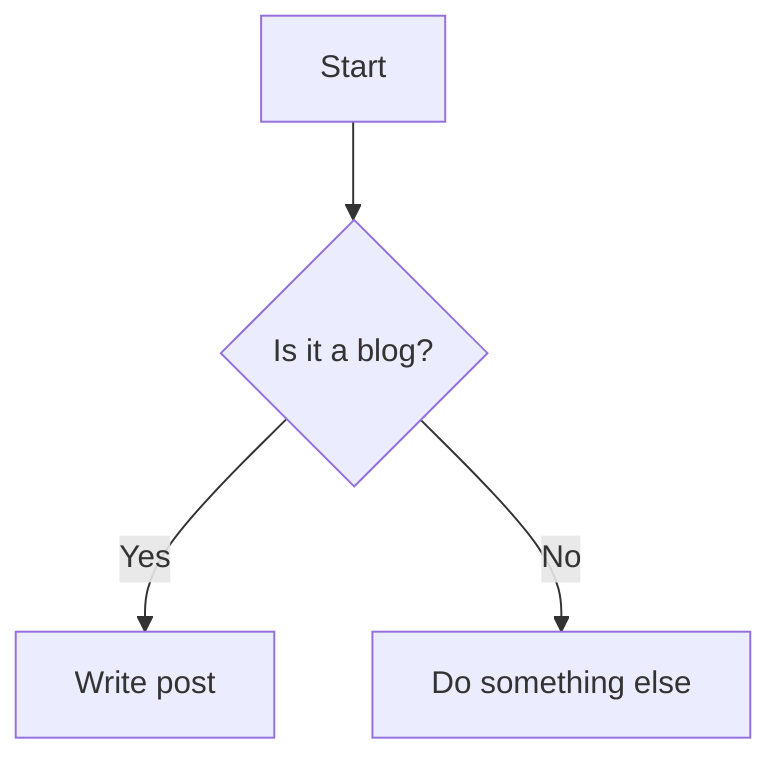

Welcome to my first blog post! This post demonstrates the basic features of the Chirpy Jekyll theme, including:

- Front matter
- Images
- Code blocks
- Prompts
- Math equations
- Mermaid diagrams

## Image Example


_Chirpy favicon as an example image._

## Code Block Example

```yaml
title: "My First Blog Post"
date: 2026-04-05 12:00:00 +0000
categories: [Blog, GettingStarted]
tags: [introduction, example]
```

```python
def hello_world():
    print("Hello, world!")
```
{: file="hello.py" }

## Prompt Example

> This is an info prompt example.
{: .prompt-info }

> This is a tip prompt example.
{: .prompt-tip }

## Math Example

Block math:

$$
E = mc^2
$$

Inline math: $a^2 + b^2 = c^2$

## Mermaid Diagram Example



---

Thank you for reading my first post!
